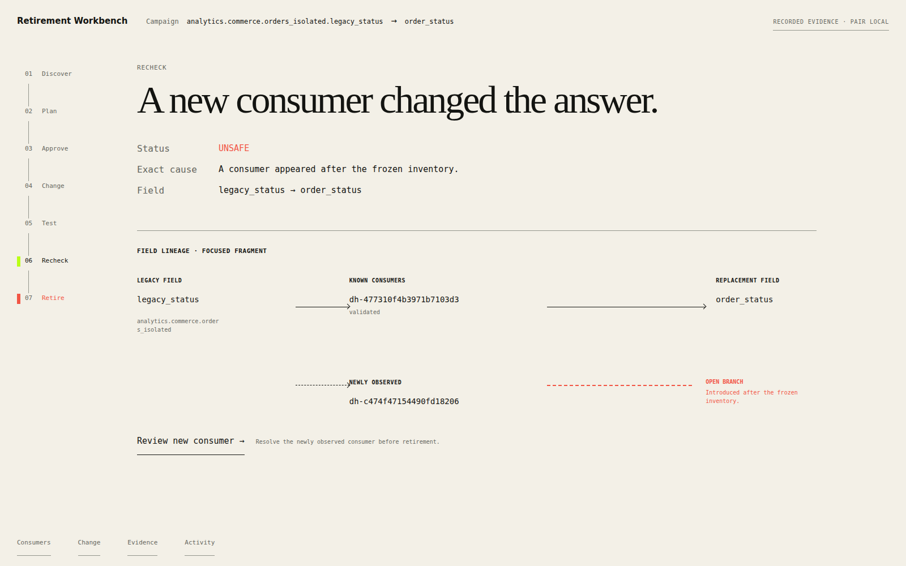
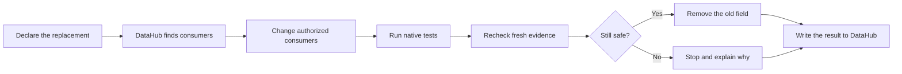

# Retirement Conductor

> Replace an old data field without breaking what still depends on it.

Retirement Conductor finds every known consumer of a legacy field, moves the
consumers it can safely change, tests them in their own systems, then performs
— or blocks — the final database change using fresh DataHub evidence.

[Open the live Workbench](https://retirement-conductor.arshgill01.chatgpt.site/workbench)
· [Inspect the definitive run](artifacts/public/definitive-consequential-run/README.md)
· [Read the product definition](docs/PRODUCT.md)



## The problem

Renaming or removing a warehouse column looks simple until a dashboard,
scheduled job, notebook, dbt model, or AI workflow still reads it.

Repository search sees only part of that dependency chain. A point-in-time
approval can also become wrong before the schema change runs. In the accepted
live-local evidence, repository analysis found one consumer while DataHub
returned 31 graph consumers over seven complete pages.

Retirement Conductor turns that risky change into one controlled campaign:



The product makes one bounded promise: **an empty result is never treated as
proof that no consumer exists.**

## What it actually does

1. Resolves one legacy field and one replacement through DataHub.
2. Records the evidence scope, freshness, pagination, permissions, and blind
   spots behind every dependency claim.
3. Maps authorized repository consumers to exact Git/dbt identities.
4. Creates a reviewable change and runs dbt parse, build, test, and declared
   semantic checks.
5. Accepts native receipts from supported consumers and keeps everything else
   visibly blocking.
6. Requeries DataHub and the native systems immediately before retirement.
7. Runs one explicitly selected, allowlisted producer action or refuses with a
   stable reason.
8. Publishes a durable campaign summary to DataHub and verifies the read-back.

`READY_TO_RETIRE` always means ready within the recorded evidence envelope —
never universally safe.

## The honest experiment changed the product

We tested the original **Retirement Lease** protocol against two alternatives
under the same late-consumer intervention:

| Arm | Producer result | Downstream result |
|---|---|---|
| Retirement Conductor, clean state | One PostgreSQL column drop; replay refused | Replacement Spark workload stayed healthy |
| Retirement Conductor, late Spark consumer | No drop | Legacy column preserved |
| Competent fresh CI, late Spark consumer | No drop | Legacy column preserved |
| Reusable point-in-time sign-off | Column dropped | Spark failed with SQLSTATE `42703` |

Competent fresh CI matched every predeclared safety property. The frozen result
was `NO_MATERIAL_ADVANTAGE`, with the recommendation `SIMPLIFY`.

So we simplified. The default producer command now performs the fresh checks
and the action in **one trusted invocation**:

```bash
retirement-conductor producer retire \
  --campaign "$CAMPAIGN_ID" \
  --action postgres
```

The short-lived plan and intent ledger remain internal recovery and audit
artifacts. The older two-step `producer plan` + `gate` surface remains for
compatibility and explicit recovery workflows, but a separately issued lease
is no longer the headline or the default.

This experiment did not prove that Retirement Conductor is safer than every
well-built CI workflow. It proved something narrower and useful: the product
can coordinate discovery, migration, native validation, fresh cross-system
verification, recovery, audit, and the final action as one reusable campaign.

## Why DataHub is essential

DataHub is the live cross-system context and reconciliation surface, not a
decorative catalog lookup.

- Field-level lineage expands the inventory beyond the repository.
- Complete pagination, timestamps, permissions, and source limitations bound
  every graph claim.
- A newly ingested Spark edge can reverse `READY_TO_RETIRE` to `UNSAFE`.
- The final check rereads DataHub instead of trusting the original inventory.
- The campaign result is written back to one stable DataHub entity and read
  back by a later agent.
- Codex can inspect DataHub through its MCP server while deterministic product
  code owns authorization, state transitions, validation acceptance, and the
  final decision.

The work also produced upstream DataHub MCP contributions:

- [Issue #194](https://github.com/acryldata/mcp-server-datahub/issues/194) — lineage pagination could hide later consumers.
- [PR #195](https://github.com/acryldata/mcp-server-datahub/pull/195) — paginate lineage at the GraphQL boundary.
- [PR #196](https://github.com/acryldata/mcp-server-datahub/pull/196) — make deployment-gate diagnostics accurate.

The two pull requests are open and review-gated; they are not represented as
merged.

## Codex is the operator, not the safety authority

The repository includes a project skill and a 16-tool Retirement Conductor MCP
server. Codex can inspect the campaign, query DataHub, plan the exact dbt
change, pause for human approval, apply it, run native validation, reconcile,
publish, and explain the outcome.

The model cannot approve its own change or override policy. A 135-attempt
ablation removed the nested Gemini planner because it added checks without
improving exact minimum-plan accuracy. A separate 72-run comparison retained
the project skill and product MCP because they improved completion and reduced
operational burden on the recorded Codex host.

The host still exposed shell, file editing, and DataHub mutation tools, so this
project makes no capability-containment claim. The rule is simple:

```text
Codex orchestrates.
Native systems test.
Deterministic code decides.
Humans authorize consequential changes.
```

## Workbench

The [Retirement Workbench](docs/runbooks/WORKBENCH.md) is a focused view of one
real campaign. It renders the same verified manifest and event history used by
the CLI and MCP server; it does not implement a second policy engine.

It can:

- show the current decision and exact cause;
- reveal Consumers, Change, Evidence, and Activity separately;
- pair explicitly with a loopback runtime using a process-scoped token; and
- run inventory or reconciliation when the local server enables those actions.

It cannot authorize a change, apply code, accept validation, or remove a
database field. Those privileges stay outside the browser. The public route
therefore opens as clearly labeled recorded evidence until an operator pairs a
local campaign.

## Evidence, not screenshots

The strongest retained results are executable and digest-bound:

| Evidence | Result |
|---|---|
| [Definitive consequential run](artifacts/public/definitive-consequential-run/index.json) | Real PostgreSQL drop, late-consumer refusal, native Spark consequence, Superset gate checks, and recovery |
| [24-case retirement gauntlet](artifacts/public/retirement-gauntlet-v2/index.json) | 24/24 oracle matches, 121/121 planted-fault recall, zero false readiness |
| [Definitive Codex run](artifacts/public/definitive-unified-run/README.md) | One exact PR/CI-backed migration, DataHub publication/read-back, and late-consumer reversal |
| [Agent boundary ablation](artifacts/public/agent-ablation/report.json) | Keep the skill and MCP; capability boundedness remains unproved |
| [Semantic planner ablation](artifacts/public/semantic-ablation-v2/REPORT.md) | Remove nested Gemini; keep bounded DataHub context |
| [DataHub contribution evidence](artifacts/public/datahub-feedback/live-evidence.json) | Live reproductions for both upstream MCP fixes |

Every public bundle states whether it is fixture, synthetic, live-local, or
recorded evidence. Raw credentials, rows, private query text, and machine-local
state are excluded.

## Try it

Requirements: Python 3.11–3.14, `uv`, Git, and GNU Make.

```bash
git clone https://github.com/Arshgill01/RetirementConductor.git
cd RetirementConductor
uv sync --all-groups
make check
```

Verify the definitive public result without starting services:

```bash
uv run python scripts/run_definitive_consequential.py verify
```

Run the complete disposable DataHub + dbt + Superset + PostgreSQL + Spark
comparison by following the
[definitive consequential runbook](docs/runbooks/DEFINITIVE_CONSEQUENTIAL.md).
The command creates only loopback-local disposable services and tears them
down afterward.

To inspect a real local campaign in the hosted Workbench:

```bash
retirement-conductor workbench serve \
  --campaign "$CAMPAIGN_ID" \
  --store .retirement-conductor/campaigns.sqlite
```

Then open the [Workbench](https://retirement-conductor.arshgill01.chatgpt.site/workbench)
and pair it with the process-scoped token printed by the server.

## Architecture and trust boundary

| Concern | Authority |
|---|---|
| Cross-system inventory and fresh reconciliation | DataHub |
| Reviewable consumer mutation | Git/dbt; bounded Superset experiment |
| Native correctness | dbt, Superset, PostgreSQL, Spark |
| Campaign history and recovery | Append-only SQLite event store |
| Final decision | Versioned deterministic policy |
| Human approval | External operator boundary |
| Final PostgreSQL action | Separately privileged, allowlisted invocation |
| Orchestration and explanation | Codex through the project skill and MCP |

More detail: [architecture](docs/ARCHITECTURE.md) ·
[contracts](docs/CONTRACTS.md) ·
[security model](docs/SECURITY_MODEL.md) ·
[requirements](docs/REQUIREMENTS_TRACEABILITY.md) ·
[evidence ledger](docs/EVIDENCE_LEDGER.md)

## Scope and limits

The production-shaped supported consumer mutation is deliberately narrow: one
Git repository containing dbt or SQL consumers, one legacy field, and one
compatible replacement. Superset and PostgreSQL are proven through disposable
live-local boundaries, not production credentials.

The evidence is author-operated. An independent practitioner run remains
`NOT_RUN`, so the repository does not claim adoption, production graph
completeness, distributed atomicity, or universal warehouse safety. A consumer
can also appear inside the final DataHub-to-PostgreSQL race; the implementation
bounds that window but cannot eliminate it across systems without a shared
transaction.

## Repository guide

- [Current truth](STATUS.md)
- [Product definition](docs/PRODUCT.md)
- [Decision log](docs/DECISIONS.md)
- [Risk register](docs/RISKS.md)
- [Agent demo](docs/runbooks/AGENT_DEMO.md)
- [Workbench runbook](docs/runbooks/WORKBENCH.md)
- [Definitive native run](docs/runbooks/DEFINITIVE_CONSEQUENTIAL.md)
- [Independent evaluation protocol](docs/runbooks/INDEPENDENT_OPERATOR.md)
- [Contributing](CONTRIBUTING.md)

Licensed under [Apache 2.0](LICENSE).
